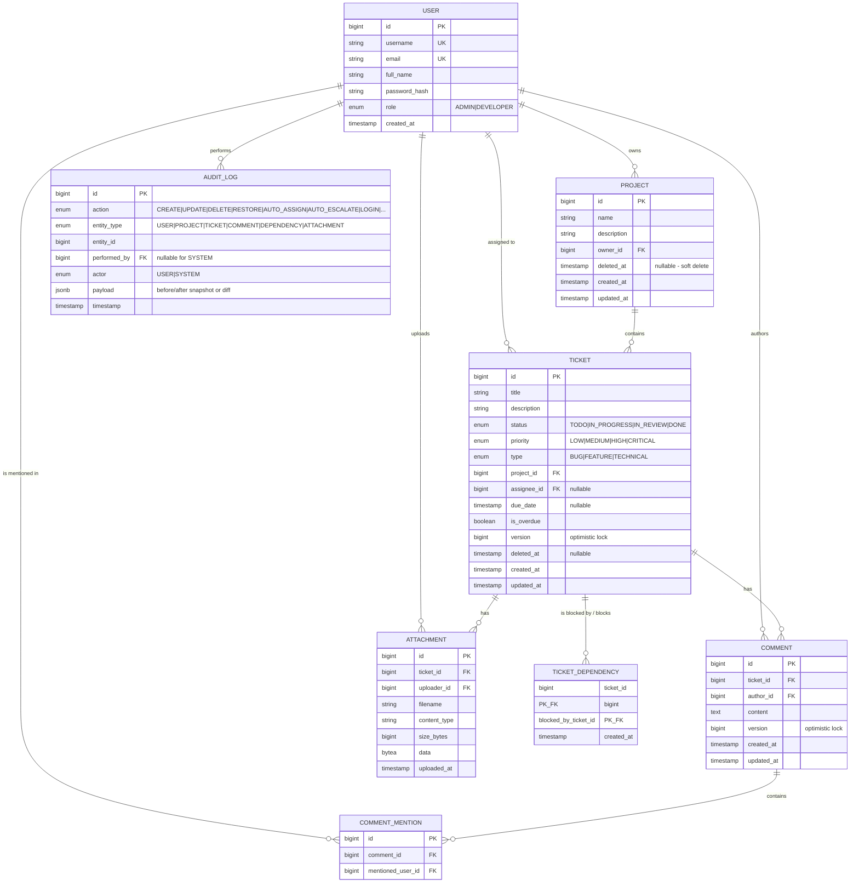
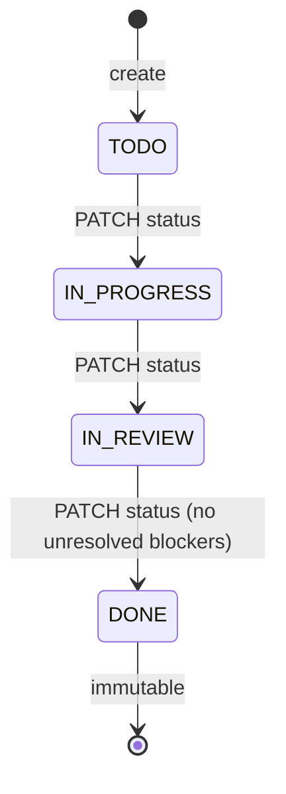
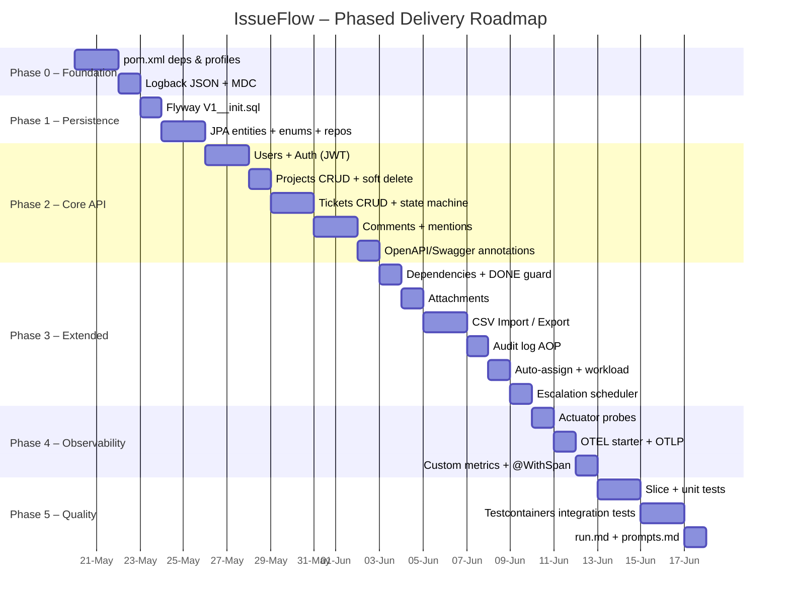

# IssueFlow – Architectural Plan & Delivery Roadmap

> **Status:** Plan for review – no production source code is generated yet.
> **Stack:** Java 21 · Spring Boot 3.4.2 · PostgreSQL 16 · OpenTelemetry · Spring Boot Actuator
> **Source documents:** `TDP_issueflow_requirements.pdf`, `README.md`, `src/main/resources/schema.sql`

---

## 1. Executive Summary

IssueFlow is a RESTful backend for a lightweight project & issue-tracking platform. The design
follows a **strict layered architecture** (Controller → Service → Repository) with **DTO mapping
at the boundary**, **JWT-based stateless security**, **soft-deletes**, **audit logging**, and a
**scheduled escalation engine**. Observability is treated as a first-class concern: every request
produces correlated **OTEL traces, JSON logs (with `trace_id`/`span_id`)**, and **Micrometer
metrics**, and the application is wired for **Kubernetes liveness/readiness probes** out of the
box.

The current skeleton ships with only the placeholder `task` table in `schema.sql` and an empty
`IssueFlowApplication`. That table will be **replaced** by the full domain schema described below.

---

## 2. Domain Model (Entity-Relationship Diagram)

The following ERD is derived directly from the functional requirements in the PDF (§2 and §3) and
the API contract in `README.md`. The placeholder `task` table is intentionally dropped — it is not
part of the target domain.



### 2.1 Key Domain Invariants

| # | Invariant | Enforced in |
|---|-----------|-------------|
| I1 | `Ticket.status` may only move forward: `TODO → IN_PROGRESS → IN_REVIEW → DONE` | `TicketService` (state-machine guard) |
| I2 | A `DONE` ticket is immutable (no field updates accepted) | `TicketService` |
| I3 | A ticket cannot transition to `DONE` while any blocker is not `DONE` | `TicketService` + `DependencyService` |
| I4 | Soft-deleted tickets/projects are hidden from default reads (Hibernate `@SQLRestriction`) | JPA entities |
| I5 | Two concurrent updates to the same ticket/comment must fail safely | `@Version` optimistic locking → HTTP 409 |
| I6 | Auto-escalation never bumps past `CRITICAL`; only sets `is_overdue=true` thereafter | `EscalationScheduler` |
| I7 | Auto-assignment picks the `DEVELOPER` with the lowest count of non-`DONE` tickets in the project; ties → oldest registrant | `TicketService.autoAssign()` |
| I8 | A manual priority change clears `is_overdue` and resets the escalation cycle | `TicketService.update()` |


---

## 3. Layered Architecture

```mermaid
flowchart TB
    subgraph Client["Client / API Consumer"]
        C1[REST Client]
    end
    subgraph Edge["Edge & Security"]
        F1[JwtAuthenticationFilter]
        F2[RequestTracingFilter<br/>OTEL trace_id/span_id → MDC]
        EH[GlobalExceptionHandler<br/>@RestControllerAdvice]
    end
    subgraph Controllers["Controller Layer"]
        UC[UserController]
        AC[AuthController]
        PC[ProjectController]
        TC[TicketController]
        CC[CommentController]
        AL[AuditLogController]
        DC[DependencyController]
        AT[AttachmentController]
        MC[MentionController]
        WC[WorkloadController]
    end
    subgraph Services["Service Layer"]
        US[UserService]
        AS[AuthService / JwtService]
        PS[ProjectService]
        TS[TicketService<br/>StateMachine + AutoAssign]
        CS[CommentService<br/>MentionParser]
        ALS[AuditLogService]
        DS[DependencyService]
        ATS[AttachmentService]
        ES[EscalationScheduler @Scheduled]
        IES[ImportExportService]
    end
    subgraph Repos["Repository Layer (Spring Data JPA)"]
        R1[(UserRepository)]
        R2[(ProjectRepository)]
        R3[(TicketRepository)]
        R4[(CommentRepository)]
        R5[(AuditLogRepository)]
        R6[(DependencyRepository)]
        R7[(AttachmentRepository)]
        R8[(MentionRepository)]
    end
    subgraph DB["PostgreSQL 16"]
        PG[(issueflow schema)]
    end
    subgraph Observability["Observability"]
        ACT[Actuator<br/>/health/liveness · /health/readiness · /metrics · /info]
        OTEL[OpenTelemetry SDK + Micrometer]
        LOG[Logback JSON + trace_id]
    end

    C1 --> F1 --> F2 --> Controllers
    Controllers --> Services --> Repos --> DB
    Services -. audit events .-> ALS
    ES -. periodic .-> TS
    Controllers -. throws .-> EH
    Services -. spans/metrics .-> OTEL
    Controllers -. logs .-> LOG
    OTEL --> EXP[(OTLP → Collector / Tempo / Jaeger)]
```

### 3.1 Package Structure

```
com.att.tdp.issueflow
├── IssueFlowApplication.java
├── config/            ← SecurityConfig, OpenTelemetryConfig, SchedulerConfig, JacksonConfig
├── common/
│   ├── error/         ← ApiError, GlobalExceptionHandler, domain exceptions
│   ├── audit/         ← @Audited annotation, AuditAspect
│   └── security/      ← JwtService, JwtAuthenticationFilter, CurrentUser argument resolver
├── user/              ← User entity, UserRepository, UserService, UserController, dto/, mapper/
├── auth/              ← AuthController, AuthService, LoginRequest/TokenResponse, TokenDenyList
├── project/           ← Project entity, ProjectService, ProjectController, dto/, mapper/
├── ticket/
│   ├── domain/        ← Ticket entity, enums (Status, Priority, Type), StateMachine
│   ├── service/       ← TicketService, AutoAssignmentService, EscalationScheduler
│   ├── api/           ← TicketController, dto/, mapper/
│   └── csv/           ← TicketCsvExporter, TicketCsvImporter
├── comment/           ← Comment entity, MentionParser, CommentService, CommentController
├── dependency/        ← TicketDependency entity, DependencyService, DependencyController
├── attachment/        ← Attachment entity, AttachmentService, AttachmentController
├── auditlog/          ← AuditLog entity, AuditLogService, AuditLogController
└── mention/           ← CommentMention entity, MentionRepository, MentionController
```

A **vertical-slice package per aggregate** keeps each feature self-contained while the
`common/` package hosts cross-cutting concerns. This honours **SOLID** (each service has a single
reason to change) and keeps dependencies one-directional (`api → service → repository`).

### 3.2 DTO Strategy

* **Request DTOs** (`*CreateRequest`, `*UpdateRequest`) carry `jakarta.validation` annotations.
* **Response DTOs** (`*Response`) never expose JPA entities directly.
* **Mappers** are interfaces compiled by **MapStruct** at build time (no reflection at runtime).
* Patch/update endpoints use **explicit nullable wrappers** (or `JsonNullable`) to distinguish
  *“field omitted”* from *“set to null”*.

### 3.3 Ticket Lifecycle State Machine




---

## 4. Cross-Cutting Concerns

| Concern | Mechanism |
|---|---|
| **Validation** | `jakarta.validation` annotations on request DTOs (`@NotBlank`, `@Email`, `@Size`, `@Pattern`, custom `@EnumValue`). Triggered by `@Valid` on controller params. |
| **Error handling** | `GlobalExceptionHandler` (`@RestControllerAdvice`) maps domain exceptions (`ResourceNotFoundException`, `IllegalStateTransitionException`, `OptimisticLockException`, `BlockedByDependencyException`, …) to RFC-7807-style `ApiError` JSON with HTTP status, timestamp, path, traceId. |
| **Security** | Stateless JWT (JJWT). `JwtAuthenticationFilter` populates `SecurityContext`. `@PreAuthorize("hasRole('ADMIN')")` gates restore/list-deleted endpoints. Passwords hashed with BCrypt. |
| **Logout** | Server-side **token deny-list** keyed by JTI with TTL == token `exp`. Stored in-memory (`Caffeine`) for the assignment scope; pluggable to Redis later. |
| **Concurrency** | JPA `@Version` on `Ticket` and `Comment` → `OptimisticLockException` → HTTP 409 `CONFLICT`. |
| **Soft delete** | `deleted_at` column + Hibernate 6 `@SQLRestriction("deleted_at IS NULL")` for default reads; explicit repository methods (`findDeletedByProjectId`) for ADMIN list/restore. |
| **Audit log** | `@Audited` annotation + Spring AOP `AuditAspect` writes an `AuditLog` row in the same transaction as the mutating action. Manual writes from `EscalationScheduler` (`AUTO_ESCALATE`) and `AutoAssignmentService` (`AUTO_ASSIGN`) with `actor = SYSTEM`. |
| **Scheduling** | `@EnableScheduling`. `EscalationScheduler` runs every 5 min (configurable), scans tickets where `due_date < now()` and `status != DONE`, bumps priority idempotently. |
| **CSV** | Apache Commons CSV (already in `pom.xml`). Quoting/escaping handled by `CSVFormat.DEFAULT.withQuoteMode(ALL_NON_NULL)`. |
| **API docs** | `springdoc-openapi` generates an OpenAPI 3.1 contract from controllers + DTO annotations. Served at `/v3/api-docs` (JSON) and `/swagger-ui.html` (interactive UI). JWT bearer scheme declared once via `@SecurityScheme` so every secured endpoint shows a “Authorize” lock in Swagger UI. |

---

## 5. Observability Integration

### 5.1 OpenTelemetry – Dependencies to add to `pom.xml`

```xml
<!-- Spring Boot Actuator: probes, /metrics, /info -->
<dependency>
    <groupId>org.springframework.boot</groupId>
    <artifactId>spring-boot-starter-actuator</artifactId>
</dependency>

<!-- OpenTelemetry Spring Boot Starter (auto-instruments Web, JDBC, Logback) -->
<dependency>
    <groupId>io.opentelemetry.instrumentation</groupId>
    <artifactId>opentelemetry-spring-boot-starter</artifactId>
    <version>2.10.0</version>
</dependency>

<!-- Micrometer → OTLP bridge (metrics) -->
<dependency>
    <groupId>io.micrometer</groupId>
    <artifactId>micrometer-registry-otlp</artifactId>
</dependency>

<!-- Micrometer Tracing bridge for OpenTelemetry (propagation) -->
<dependency>
    <groupId>io.micrometer</groupId>
    <artifactId>micrometer-tracing-bridge-otel</artifactId>
</dependency>

<!-- JSON structured logging with trace_id / span_id in MDC -->
<dependency>
    <groupId>net.logstash.logback</groupId>
    <artifactId>logstash-logback-encoder</artifactId>
    <version>8.0</version>
</dependency>

<!-- OpenAPI 3 spec + Swagger UI for Spring Boot 3 / WebMVC -->
<dependency>
    <groupId>org.springdoc</groupId>
    <artifactId>springdoc-openapi-starter-webmvc-ui</artifactId>
    <version>2.7.0</version>
</dependency>
```

> The starter `opentelemetry-spring-boot-starter` auto-instruments `RestTemplate`,
> `WebClient`, the embedded servlet container, JDBC, Logback (MDC propagation), and
> scheduled tasks. No manual `Tracer` wiring is needed for the happy path; custom
> spans inside `TicketService.escalate()` and `AutoAssignmentService.assign()` will be
> added via `@WithSpan` for business-level traceability.

### 5.2 `application.yaml` additions

```yaml
spring:
  application:
    name: issueflow

management:
  endpoints:
    web:
      exposure:
        include: health, info, metrics, prometheus
  endpoint:
    health:
      probes:
        enabled: true            # exposes /actuator/health/liveness and /readiness
      show-details: when_authorized
      group:
        readiness:
          include: db, diskSpace
  health:
    livenessstate:
      enabled: true
    readinessstate:
      enabled: true
  info:
    env.enabled: true
    git.mode: full
    build.enabled: true
  tracing:
    sampling:
      probability: 1.0           # 100% in dev; lower in prod via profile override
  otlp:
    tracing:
      endpoint: ${OTEL_EXPORTER_OTLP_ENDPOINT:http://localhost:4318/v1/traces}
    metrics:
      export:
        url: ${OTEL_EXPORTER_OTLP_ENDPOINT:http://localhost:4318}/v1/metrics
        step: 30s

otel:
  service:
    name: issueflow
  resource:
    attributes:
      deployment.environment: ${SPRING_PROFILES_ACTIVE:dev}
      service.version: @project.version@
```

### 5.3 What we trace, measure, and log

| Signal | Examples |
|---|---|
| **Traces** | HTTP server spans (auto), JDBC spans (auto), custom spans on `TicketService.transition`, `EscalationScheduler.runOnce`, `AutoAssignmentService.assign`, `TicketCsvImporter.parse`. |
| **Metrics** | `http.server.requests` (auto, RED), `jvm.*`, `hikaricp.*`, `jdbc.*`; custom counters `issueflow.tickets.created`, `issueflow.tickets.auto_assigned`, `issueflow.tickets.escalated`, gauge `issueflow.tickets.overdue`. |
| **Logs** | Logback JSON via `logstash-logback-encoder` writing one event per line with `@timestamp`, `level`, `logger`, `message`, `trace_id`, `span_id`, `userId` (from MDC), `requestId`. |


---

## 6. API Documentation (Swagger / OpenAPI)

Every public endpoint defined in `README.md` is rendered as an interactive Swagger UI page so
that reviewers and integrators can explore and call the API without an external tool. The OpenAPI
contract is generated **at runtime from the controller/DTO source of truth** by
`springdoc-openapi`, eliminating drift between code and documentation.

### 6.1 Endpoints exposed

| Surface | Default path | Purpose |
|---|---|---|
| OpenAPI 3.1 JSON | `GET /v3/api-docs` | Machine-readable contract (for codegen, Postman import, contract tests). |
| OpenAPI 3.1 YAML | `GET /v3/api-docs.yaml` | Same contract in YAML. |
| Swagger UI | `GET /swagger-ui.html` (redirect → `/swagger-ui/index.html`) | Interactive console with “Try it out” + JWT Authorize button. |

### 6.2 `application.yaml` additions

```yaml
springdoc:
  api-docs:
    path: /v3/api-docs
    enabled: true
  swagger-ui:
    path: /swagger-ui.html
    operationsSorter: method
    tagsSorter: alpha
    tryItOutEnabled: true
    displayRequestDuration: true
  show-actuator: false           # keep Actuator out of the public contract
  packages-to-scan: com.att.tdp.issueflow
  default-produces-media-type: application/json
```

A small `OpenApiConfig` bean centralises metadata and the JWT security scheme so individual
controllers stay clean:

```java
@OpenAPIDefinition(
    info = @Info(
        title = "IssueFlow API",
        version = "v1",
        description = "Ticket management backend – TDP 2026 Home Assignment",
        contact = @Contact(name = "IssueFlow Team")),
    servers = @Server(url = "/", description = "Default"))
@SecurityScheme(
    name = "bearerAuth",
    type = SecuritySchemeType.HTTP,
    scheme = "bearer",
    bearerFormat = "JWT")
@Configuration
public class OpenApiConfig { }
```

Controllers then declare `@SecurityRequirement(name = "bearerAuth")` (or inherit it via a base
annotation) so the lock icon appears in Swagger UI for protected operations. `/auth/login`,
`/v3/api-docs/**`, `/swagger-ui/**`, and `/actuator/health/**` are added to the Spring Security
permit-list.

### 6.3 Conventions per controller / DTO

* `@Tag(name = "Tickets", description = "...")` at the controller class level groups operations.
* `@Operation(summary = "...", description = "...")` on each handler method.
* `@ApiResponse(responseCode = "409", description = "Optimistic lock conflict", content = ...)`
  on endpoints that surface known domain errors, paired with the `ApiError` schema from
  `common/error/`.
* Request/response DTOs use `@Schema(description = "...", example = "...")` on each field so the
  rendered models in Swagger UI are self-explanatory.
* Bean Validation annotations (`@NotBlank`, `@Email`, `@Size`, `@Pattern`) are automatically
  reflected as `required`, `format`, `minLength`, `pattern` in the generated schema.

### 6.4 Build-time export (optional)

The `springdoc-openapi-maven-plugin` can write `openapi.json` to `target/` during `mvn verify`,
enabling contract tests in CI and SDK generation. This is opt-in and not on the critical path.

---

## 7. Health & Reliability (Spring Boot Actuator)

Spring Boot Actuator natively exposes Kubernetes-style probes when
`management.endpoint.health.probes.enabled=true`. Combined with `ApplicationAvailability`,
the application participates in the standard `LivenessState` / `ReadinessState` lifecycle.

| Probe | Endpoint | Meaning | Suggested K8s setting |
|---|---|---|---|
| **Liveness** | `GET /actuator/health/liveness` | The JVM is reachable and not in a broken state. Failure → pod restart. | `initialDelaySeconds: 20`, `periodSeconds: 10`, `failureThreshold: 3` |
| **Readiness** | `GET /actuator/health/readiness` | The app can serve traffic. Includes the `db` indicator – fails if PostgreSQL is unreachable. | `initialDelaySeconds: 10`, `periodSeconds: 5`, `failureThreshold: 3` |
| **Startup** | `GET /actuator/health` | Used during boot before liveness kicks in. | `failureThreshold: 30`, `periodSeconds: 5` |

### Example Kubernetes probe block

```yaml
livenessProbe:
  httpGet: { path: /actuator/health/liveness, port: 8080 }
  initialDelaySeconds: 20
  periodSeconds: 10
readinessProbe:
  httpGet: { path: /actuator/health/readiness, port: 8080 }
  initialDelaySeconds: 10
  periodSeconds: 5
```

### Graceful shutdown

```yaml
server:
  shutdown: graceful
spring:
  lifecycle:
    timeout-per-shutdown-phase: 25s
```

This lets in-flight HTTP requests and scheduled jobs finish before the JVM exits, matching the
`terminationGracePeriodSeconds` of a typical Kubernetes deployment.

---

## 8. Testing Strategy

| Test Type | Tool | Scope | Example |
|---|---|---|---|
| **Unit** | JUnit 5 + Mockito | Pure logic: state-machine guard, mention parser, auto-assign tie-break, escalation idempotency. | [`TicketStateMachineTest`](src/test/java/com/att/tdp/issueflow/ticket/domain/TicketStateMachineTest.java), [`MentionParserTest`](src/test/java/com/att/tdp/issueflow/comment/MentionParserTest.java), [`TicketServiceTest`](src/test/java/com/att/tdp/issueflow/ticket/service/TicketServiceTest.java), [`EscalationServiceTest`](src/test/java/com/att/tdp/issueflow/ticket/escalation/EscalationServiceTest.java) |
| **Web slice** | `@WebMvcTest` + MockMvc | Validation, status codes, JSON shape, security filter chain. | [`TicketControllerTest`](src/test/java/com/att/tdp/issueflow/ticket/api/TicketControllerTest.java), [`UserControllerTest`](src/test/java/com/att/tdp/issueflow/user/UserControllerTest.java) |
| **Persistence slice** | `@DataJpaTest` + Testcontainers PostgreSQL | Custom queries, soft-delete `@SQLRestriction`, optimistic-lock behaviour. | _planned in Phase 5_ |
| **Integration** | `@SpringBootTest` + Testcontainers | End-to-end: login → create project → import CSV → escalate → audit log assertion. | [`ReadmeApiHappyPathIT`](src/test/java/com/att/tdp/issueflow/it/ReadmeApiHappyPathIT.java) |
| **Contract / smoke** | `RestAssured` against the booted app | One happy-path script per API table row in `README.md`. | [`ReadmeApiHappyPathIT`](src/test/java/com/att/tdp/issueflow/it/ReadmeApiHappyPathIT.java) |

> Note: the current `pom.xml` pulls in H2 for tests, but H2 does not faithfully reproduce
> PostgreSQL semantics (JSONB, `@SQLRestriction`, sequence behaviour). Phase 5 swaps H2 for
> `org.testcontainers:postgresql`.

---

## 9. Phased Task Breakdown

The implementation is split into **six phases**, each producing a runnable, testable increment.
A live Gantt view is below; the same items are tracked in the agent task list.



### Phase 0 — Foundation (≈ 2 days)
1. Add dependencies to `pom.xml` via Maven: Actuator, OTEL starter, Micrometer-OTLP,
   Micrometer-tracing-bridge-otel, Logstash Logback encoder, `springdoc-openapi-starter-webmvc-ui`,
   MapStruct, JJWT, Flyway, Testcontainers (Postgres + JUnit), Caffeine.
2. Split `application.yaml` into `application.yaml` + `application-dev.yaml` +
   `application-prod.yaml`; move test config (already in `src/test/resources/application.yaml`)
   to use Testcontainers instead of H2.
3. Add `logback-spring.xml` with `LogstashEncoder` and an MDC pattern including `trace_id`,
   `span_id`, `userId`, `requestId`.

### Phase 1 — Persistence (≈ 3 days)
1. Delete the placeholder `task` table from `schema.sql` and the matching seed in `data.sql`.
2. Introduce Flyway and author `V1__init_schema.sql` matching the ERD in §2 (all FK constraints,
   indexes on `ticket(project_id, status)`, `ticket(due_date) WHERE deleted_at IS NULL`,
   `audit_log(entity_type, entity_id)`, `comment_mention(mentioned_user_id)`).
3. Write JPA entities, enums, and `JpaRepository` interfaces. Add custom queries:
   `countOpenByAssigneeAndProject`, `findOverdueBelowCritical`, `findDeletedByProjectId`.
4. `@DataJpaTest` for each repository against Testcontainers Postgres.

### Phase 2 — Core API (≈ 7 days)
1. **Users**: CRUD + BCrypt password hashing. Unique constraints on `username`/`email`.
2. **Auth**: `JwtService` (HS256 with rotating secret from env), `JwtAuthenticationFilter`,
   `TokenDenyList` (Caffeine), `/auth/login`, `/auth/logout`, `/auth/me`.
3. **Projects**: CRUD + soft delete + `@PreAuthorize` for restore.
4. **Tickets**: CRUD, `StateMachine` guard, `@Version` for concurrency, `isOverdue` projected
   in every response.
5. **Comments**: CRUD + `MentionParser` (regex `@([A-Za-z0-9_]+)`, case-insensitive lookup).
6. `GlobalExceptionHandler` returning RFC-7807 errors.
7. **OpenAPI**: add `OpenApiConfig` (info + JWT `bearerAuth` security scheme), annotate every
   controller with `@Tag` + `@Operation`, every DTO field with `@Schema`, and add
   `@ApiResponse` entries for `400`, `401`, `403`, `404`, `409`. Permit-list `/v3/api-docs/**`
   and `/swagger-ui/**` in Spring Security.

### Phase 3 — Extended Features (≈ 7 days)
1. **Dependencies** API + transition guard preventing `DONE` when blockers are open.
2. **Attachments** with size (`MaxUploadSizeExceededException` → 413) and MIME-type allow-list.
3. **CSV import/export** via Commons CSV with proper quoting; import returns per-row error report.
4. **Audit log** via `@Audited` + AOP; manual emit for `AUTO_ASSIGN` and `AUTO_ESCALATE`.
5. **Auto-assignment** least-loaded-developer query + `GET /projects/{id}/workload`.
6. **Escalation** `@Scheduled(fixedDelayString = "${issueflow.escalation.interval:PT5M}")`.

### Phase 4 — Observability (≈ 3 days)
1. Enable Actuator probes; verify `/actuator/health/liveness` and `/readiness`.
2. Confirm OTEL auto-instrumentation by booting the app against a local `otel-collector`
   container (add to `compose.yml`).
3. Add `@WithSpan` and `MeterRegistry`-backed counters for the business operations listed in
   §5.3.

### Phase 5 — Quality & Documentation (≈ 5 days)
1. Achieve meaningful coverage on services and state machine (target ≥ 80% line on `service/`).
2. End-to-end Testcontainers test that walks the README API table.
3. Author `run.md` (install, compose up, build, run, test, OTEL collector optional, Swagger UI
   URL `http://localhost:8080/swagger-ui.html`) and `prompts.md` (records that
   **Claude Opus 4.7** via Augment Agent was used, with the prompt excerpts that produced this
   plan and the subsequent code).

---

## 10. Risks & Trade-offs

| Risk | Mitigation |
|---|---|
| H2 cannot emulate `JSONB` / `@SQLRestriction` quirks | Use Testcontainers PostgreSQL from Phase 1 onward. |
| In-memory token deny-list is lost on restart | Documented as a known scope limit; Caffeine entries expire with the token TTL, so worst case is a re-login. Swap-in Redis is a 1-class change. |
| OTEL starter version (`2.10.0`) is independent of Spring Boot BOM | Pinned explicitly; Phase 0 verifies compatibility with Boot 3.4.2. |
| Auto-escalation under heavy load could thrash priorities | Job is idempotent (`CRITICAL` never re-bumps), runs single-threaded via default `ThreadPoolTaskScheduler` (pool size 1), and writes an audit row only when priority changes. |
| Soft-deleted parents with live children | Cascade rules: soft-deleting a project soft-deletes its tickets in the same transaction. |

---

## 11. Known Issues

| Area | Issue | Impact | Suggested fix |
|---|---|---|---|
| `CommentService.delete` | Hard-deletes the `comments` row without first removing the dependent `comment_mentions` rows. `fk_mentions_comment` has no `ON DELETE CASCADE`, and `Comment` has no `@OneToMany` back-reference, so neither the DB nor JPA cleans up. | `DELETE /tickets/{tid}/comments/{cid}` against a comment with at least one mention raises a foreign-key violation → HTTP 500. Comments without mentions delete normally, masking the bug in casual testing. | Either (a) call `mentionRepository.deleteByCommentId(commentId)` + `flush()` before `commentRepository.delete(comment)` — mirrors the existing pattern in `CommentService.update`; or (b) add a Flyway migration switching `fk_mentions_comment` to `ON DELETE CASCADE`. Belt-and-suspenders combination is also fine. |

---

## 12. Approval Checklist

- [ ] ERD in §2 matches expected business model
- [ ] Package layout in §3.1 is acceptable
- [ ] OTEL dependency set in §5.1 is approved (or substitute the OTEL Java Agent approach)
- [ ] Swagger / OpenAPI approach in §6 is acceptable (`springdoc-openapi` 2.7.0)
- [ ] Actuator probe contract in §7 fits the deployment target
- [ ] Phased plan in §8 is acceptable as the execution order

Once approved, execution will start at **Phase 0** and each phase will be opened as a separate
working session with its own tests before moving on.
